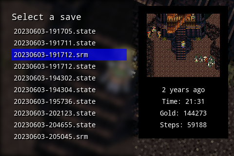

select-save is a small [SDL](https://www.libsdl.org) app designed to run alongside [RetroArch](https://www.retroarch.com) on a device like an [RG351M](https://anbernic.com/products/anbernic-rg351m) to provide the following features:

- Visually select a save state or save file for many games, captured by [study-sync](https://github.com/sartak/study-sync)
- Preview each save with a screenshot
- Extract and display metadata from each save
- Copy the selected save file into place next to its game

Here's an example extraction configuration to display three pieces of metadata for `.srm` files: the time played clock (format: `mm:ss`, where `mm` is the value at byte `0x263` and `ss` is the value at `0x264`; with the latter being two digits long padded by `0`), the amount of gold (formatted as an integer where the three bytes `0x260`, `0x261`, and `0x261` are read into a 24-bit number), and the number of steps (calculated similarly to gold).

```json
{
  "srm": [
    "Time: {0x263}:{0x264:02}",
    "Gold: {0x260~0x262}",
    "Steps: {0x266~0x268}"
  ]
}
```

which looks like this:


